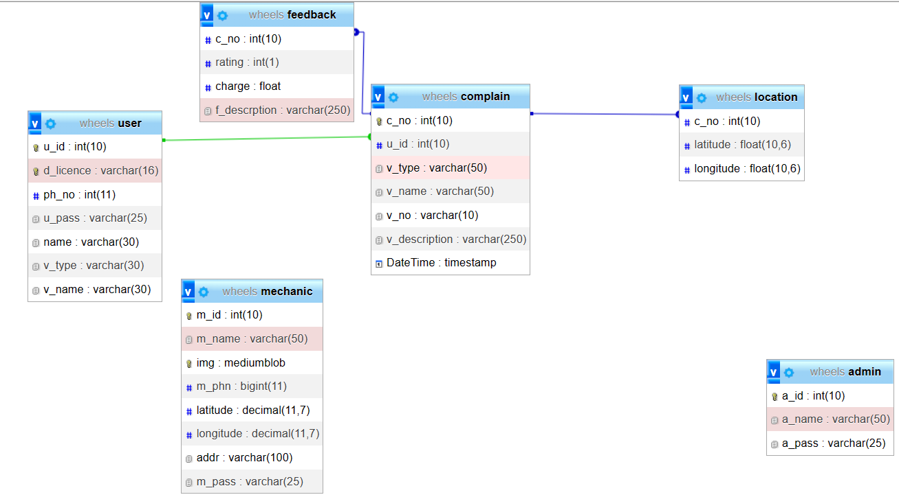

# About 
This project is a tool that can quickly and accurately suggest nearby mechanics within a range of 25 km. It can provide users with the contact information of reliable mechanics in their area, making it easier for them to get the help they need in emergency situations. Whether you’re dealing with a sudden breakdown or just need routine maintenance.

## STACK
- HTML 
- CSS 
- JAVASCRIPT
- PHP
- MY SQL 
- APACHE 


## Setup database
### Tables 
- admin
  ```
  a_id : int(10)  PK not null
  a_name : varchar(50)
  a_pass : varchar(25)
  ```
- user
    ```
    u_id : int(10) PK not null
    d_licence : varchar(16) UK not null
    ph_no : int(11) not null
    u_pass : varchar(25) not null
    name : varchar(30) not null
    v_type : varchar(30) not null
    v_name : varchar(30) not null
    ```
- mechanic
     ```
    m_id : int(10) PK not null
    m_name : varchar(50) not null
    img : mediumblob not null
    m_phn : bigint(11) not null
    latitude : decimal(11,7) not null
    longitude : decimal(11,7) not null
    addr : varchar(100) not null
    m_pass : varchar(25) not null
    ```
- complain
     ```
     c_no : int(10) PK not null
     u_id : int(10) FK not null
     v_type : varchar(50) not null
     v_name : varchar(50) not null
     v_no : varchar(10) not null
     v_description : varchar(250) not null
     DateTime : timestamp not null 
    ```
- location
     ```
     c_no : int(10) FK not null
     latitude : float(10,6)not null
     longitude : float(10,6) not null
    ```
- feedback
     ```
     c_no : int(10) not null
     rating : int(1) not null
     charge : float not null
     f_descrption : varchar(250) not null

    ```
### Relationship


## Setup project
### Xampp
*  Download and install XAMPP from the official website1.
* Open the XAMPP Control Panel and start the Apache and MySQL modules.
* Place your project files in the htdocs folder located in the XAMPP installation directory.
* In your web browser, navigate to localhost/your_project_folder to access your project.

### Individual Steps
* Download and install Apache, PHP, and MySQL individually on your system.
* Configure Apache to work with PHP by adding the appropriate lines to the Apache configuration file.
* Start the Apache and MySQL services.
* Place your project files in the document root directory specified in the Apache configuration file.
* In your web browser, navigate to localhost/your_project_folder to access your project.


## Project Structure
- Admin
  - css - holds css and images
  - other - php and html files
- Mechanic
  - css - holds css and images
  - other - php and html files
- User
  - css - holds css and images
  - other - php and html files
- Service 
  - Other Files - holds database connection file

## Establish Connection with database
* Add this file inside Service folder name it connect.php
```<?php 
// Database configuration 
$dbHost     = "localhost"; 
$dbUsername = "root"; 
$dbPassword = "password"; 
$dbName     = "databasename"; 
 
// Create database connection 
$con = mysqli_connect($dbHost, $dbUsername, $dbPassword, $dbName); 

// Check connection 
if (!$con) {
    echo "Failed to connect to MySQL: " . mysqli_connect_error();
    exit();
}
```

##Working

* After setup - got to this url
  * http://localhost/MechOnWhell-main/index.php
* Admin 
  *  Only admin can create mechanic profile .
  *  Can Access Complaints,User and Mechanic Details
* Register User
  * Can register a new user
* Login User
  * After Login user get redirected to Complain page
* Complain page
  * User can register complaint to access Mechanics in 25km range
  * User can also access it's previous complaints
* NearBy page
  * User will see all the Mechanics in 25km range
  * User can give feedback about the services and charges Mechanic charged


